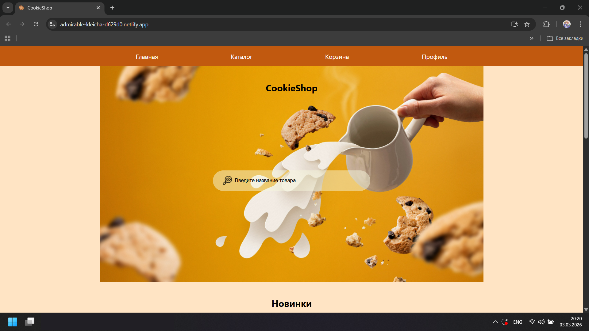

# Магазин выпечки "CookieShop"

## О проекте

Это учебный проект магазина по продаже выпечки. 
Реализован функционал сортировки, оформления заявки о покупке, строки поиска для нахождения нужной продукции, добавления продукта в корзину. Имеется личный кабинет.

## Функционал

- Оформление заказа
- Поиск продукции с помощью поисковой строки
- Авторизация в личный кабинет пользователя
- Регистрация
- Сохранение списка покупок в localeStorage

## Стек технологий

- **Frontend:** React, Redux Toolkit, JavaScript, React Router
- **Стили:** SCSS
- **Сборка:** WebPack

## Установка и запуск

1.  Склонировать репозиторий:
    `git clone https://github.com/твой-логин/название-репозитория.git`
2.  Перейти в папку с проектом:
    `cd название-репозитория`
3.  Установить зависимости:
    `npm install`
4.  Запустить проект:
    `npm start`

## Демо

Посмотреть живую версию можно здесь: [https://inspiring-concha-afa530.netlify.app/](ссылка)

## Доступные скрипты

В директории проекта вы можете выполнить следующую команду: 

### `npm start`

Запускает приложение в режиме разработки.

Страница будет перезагружаться при внесении изменений.\
Вы также можете увидеть ошибки линтинга в консоли.

### `npm test`

Запускает средство запуска тестов в интерактивном режиме отслеживания изменений.

### `npm run build`

Собирает приложение для продакшена в папку `build`.
В продакшен-режиме корректно упаковывает React и оптимизирует сборку для достижения наилучшей производительности.

Сборка минифицирована, а имена файлов содержат хеши.
Ваше приложение готово к развертыванию!

### `npm run eject`

**Примечание: это операция в один конец. После выполнения команды `eject` вы не сможете вернуться назад!**

Если вас не устраивают выбранные инструменты сборки и параметры конфигурации, вы можете в любой момент выполнить команду `eject`. Эта команда удалит единственную зависимость сборки из вашего проекта.

Вместо этого она скопирует все файлы конфигурации и транзитивные зависимости (webpack, Babel, ESLint и т. д.) прямо в ваш проект, так что вы получите полный контроль над ними. Все команды, кроме `eject`, по-прежнему будут работать, но они будут указывать на скопированные скрипты, чтобы вы могли их изменить. На этом этапе вы остаетесь один на один со своими проблемами.